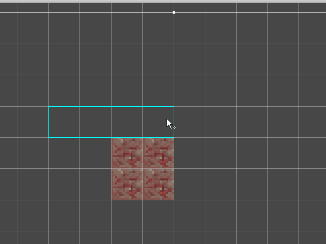

# TestTileMap - Unity Tilemap Tests

## DefaultBrush Bugs

- [x] rotate & flip works for box but not flood fill - fixed in TestRandomBrush flood fill
- [ ] when move is selected without a selection it draws a white filled box that does nothing?
  
- [ ] pivot etc. private?
  - would help with implementing some of this stuff?
- [ ] change size of brush with ctrl and paint with long brush last position stamp has only 1 tile? this is broke in base too
  

## RandomBrush Bugs

- [ ] update too much - only when position changes
- [x] pick big area paint only 1 tile? unlike boxFill
- [x] box & flood fill not working
- [x] not saving tiles and from preview to use in paint
- [ ] move????????????????????????????????????
- [x] not using CreateAssetMenu
- [x] not showing in inspector

## RandomBrush Features

- [x] choose random brush based on probability
- [x] randomize the transform too

### TODO:

- [ ] add screenshots to readme!!!
- [ ] my flood fill does not expand map like base!?
- [ ] flood fill does not fill closed loop wall - IT DOES but requires tiles to match exactly mine allows any but should be fixed!
